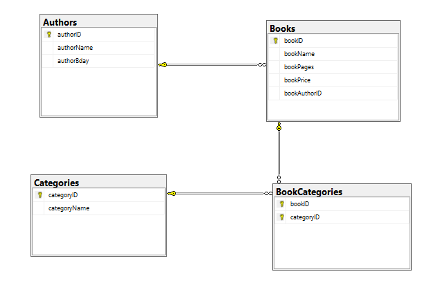
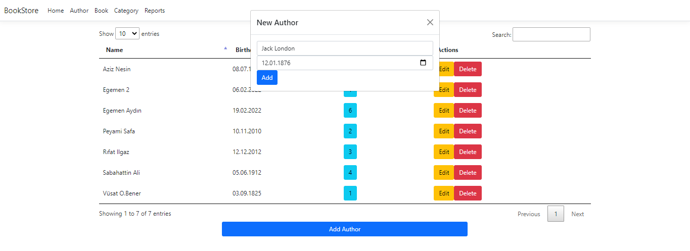
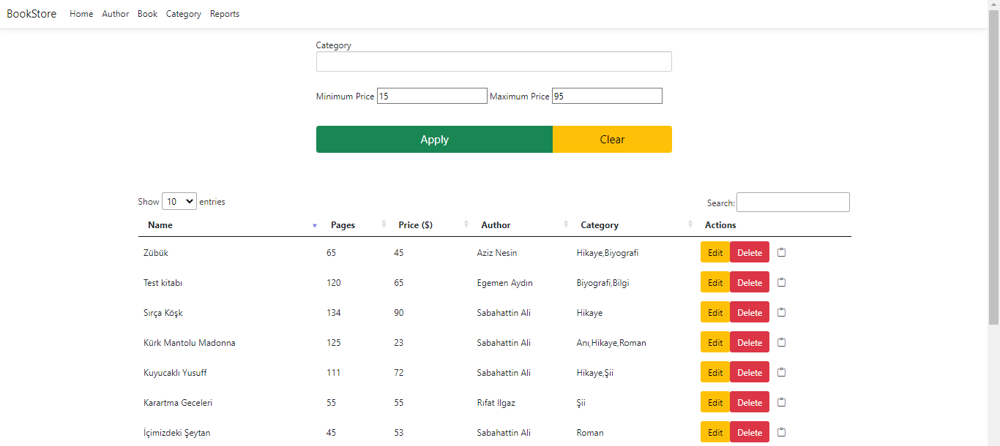

# Book_store_web_app

I made this project for learning the basics in the mvc .net projects 
Main focus is list tables and doing CRUD operations on html-razor pages.
  

Database -> MSSQL  
Controllers -> C#  
ORM -> Dapper  
Front-end -> bootstrap 5 / javascript (jquery,ajax,chart.js,selectize.js,datatables)

## Db example;

## CRUD Pop-ups

## Filter for tables

*Note: The Connection String is in the appsetting.json*
